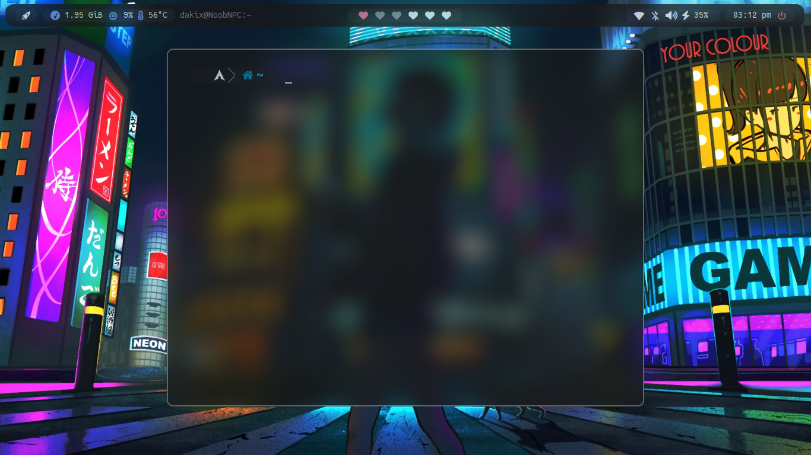

# Scripts De Instalacion

en este scripts se istalara automaticamente el dotfile.

## Instalacion

ejecuta el scripts,algunos cosas no se respaldan(zshrc,picom,dunst).

```bash
  curl https://raw.githubusercontent.com/Shidohs/dotfile-i3-bspwm/main/install_config.sh > install_config.sh
chmod +x install_config.sh

```
    
## Contenido

- WM                    :[bspwm](https://github.com/baskerville/bspwm)
- Shell                 :[zsh](https://wiki.archlinux.org/index.php/zsh) con [oh my zsh](https://github.com/ohmyzsh/ohmyzsh) framework!
- Terminal              :[kitty](https://github.com/kovidgoyal/kitty) y [alacritty](https://github.com/alacritty/alacritty)
- Panel                 : [polybar](https://github.com/polybar/polybar)
- Compositor            :[picom](https://github.com/FT-Labs/picom)
- Notify                : [dunst](https://wiki.archlinux.org/index.php/Dunst) 🔔
- Launcher              :[rofi](https://github.com/davatorium/rofi)
- File Manager          :[thunar](https://wiki.archlinux.org/index.php/Thunar)/[nemo](https://github.com/linuxmint/nemo)/[ranger](https://github.com/ranger/ranger) 📂 
- Wallpaper Manager     :[feh](https://feh.finalrewind.org/)


## Screenshots



