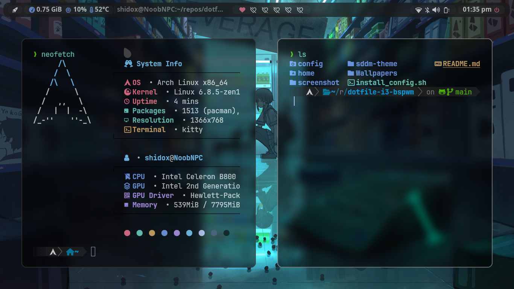

{width=200px}

# Scripts De Instalacion

En este scripts se instalará automáticamente todo lo necesitarío para su funcionamiento, debes tomar en cuenta que esta hecho para una instalación de 0 en arch, así que cualquier configuración que tengas se puede perder, aunque algunas cositas se respaldan pero no todas.

## Instalacion

Algunas cosas no se respaldan, ASÍ QUE TEN CUIDADO.
Para ejecutar el scripts:

- cosas que se respaldan son: .zshrc

```bash
  curl https://raw.githubusercontent.com/Shidohs/dotfile-bspwm-glass/main/install_config.sh > install_config.sh
chmod +x install_config.sh

```

```bash
 ./install_config.sh

```

## Contenido

- WM : [bspwm](https://github.com/baskerville/bspwm)
- Shell :[zsh](https://wiki.archlinux.org/index.php/zsh) con [oh my zsh](https://github.com/ohmyzsh/ohmyzsh) framework!
- Terminal :[kitty](https://github.com/kovidgoyal/kitty) y [alacritty](https://github.com/alacritty/alacritty)
- Panel : [polybar](https://github.com/polybar/polybar)
- Compositor :[picom](https://github.com/FT-Labs/picom)
- Notify : [dunst](https://wiki.archlinux.org/index.php/Dunst) 🔔
- Launcher :[rofi](https://github.com/davatorium/rofi)
- File Manager :[thunar](https://wiki.archlinux.org/index.php/Thunar)/[nemo](https://github.com/linuxmint/nemo)/[ranger](https://github.com/ranger/ranger) 📂
- Wallpaper Manager : [feh](https://feh.finalrewind.org/)

## Screenshots




## Acerca de

- AUTOR: [@Shidohs](https://github.com/Shidohs)
- Gracias a [adi1090x](https://github.com/adi1090x/rofi) por los temas de rofi
- Gracias a [gh0stzk](https://github.com/gh0stzk/dotfiles) Por La Configuracion Base
